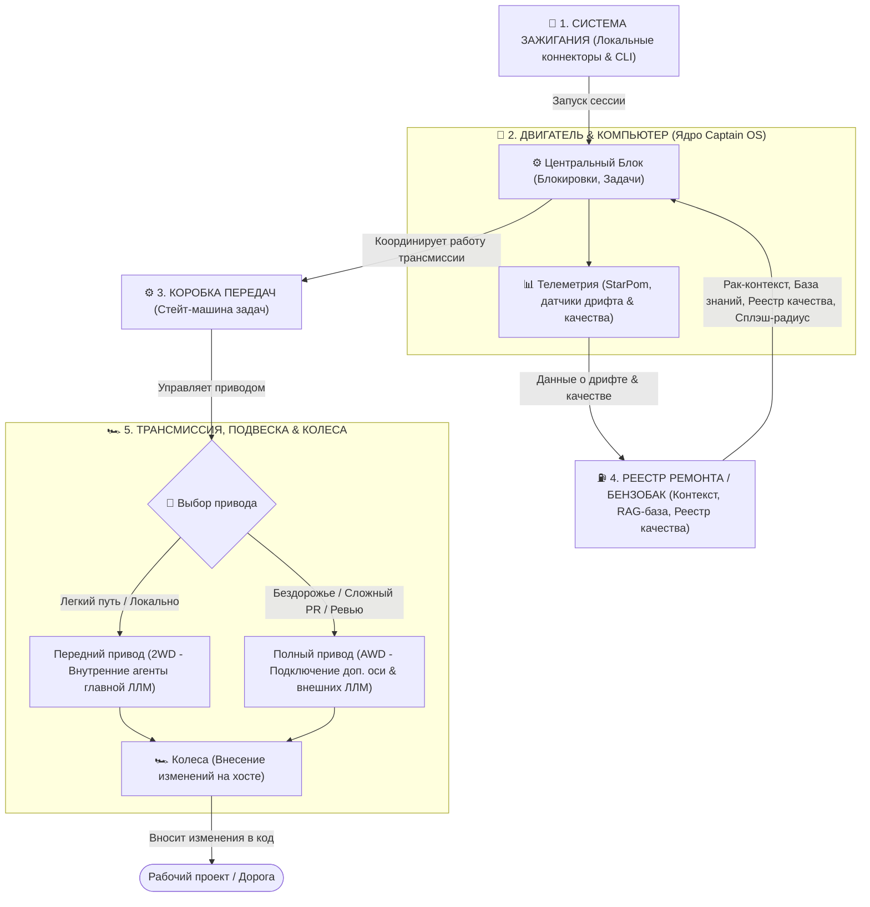
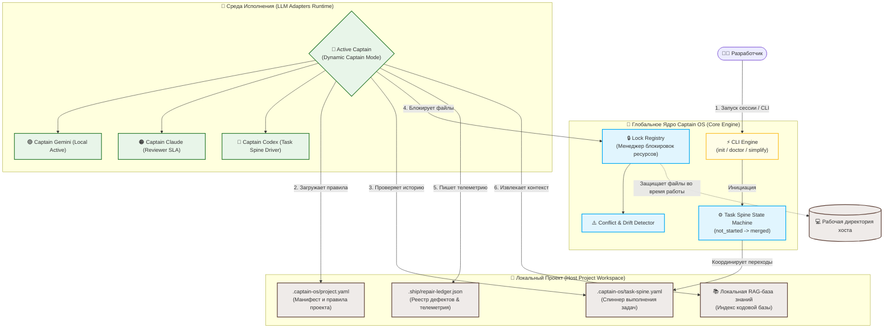
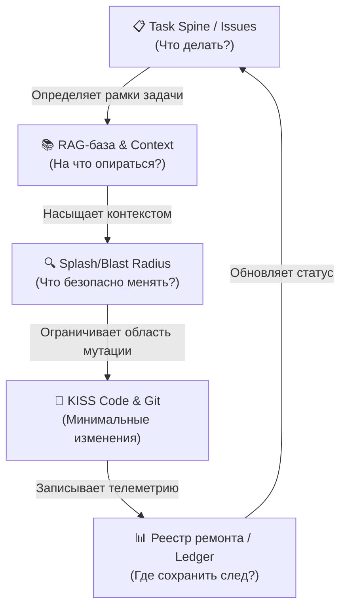
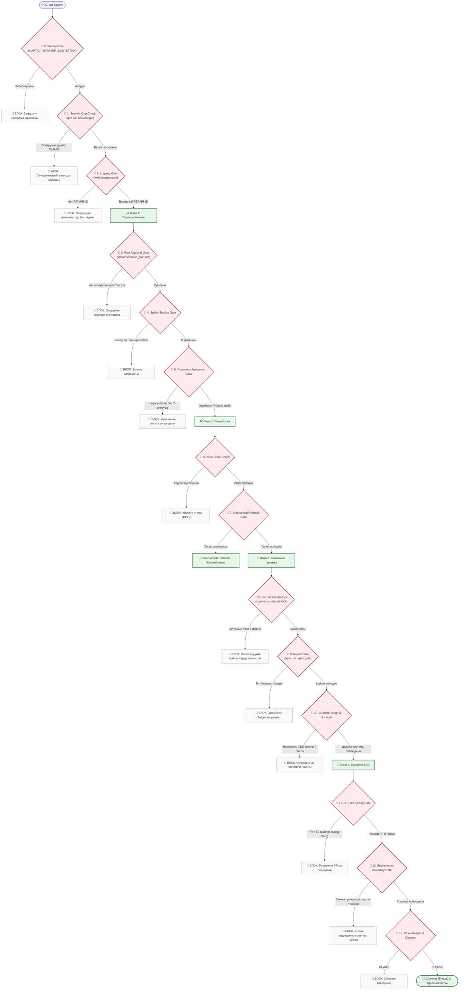
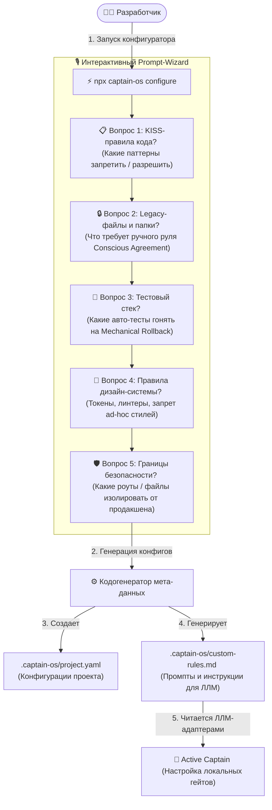
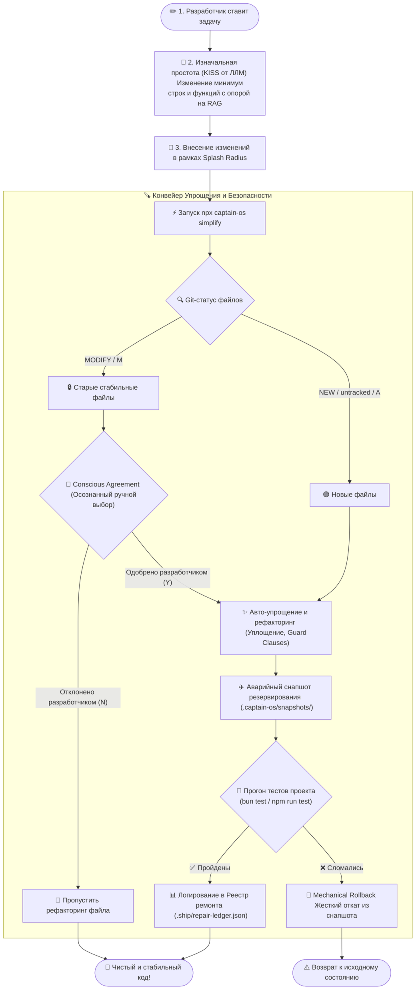

# 📦 🤖 Captain OS: Universal AI Coding Agent Core & Workspace Guard

[](https://opensource.org/licenses/MIT)
[]()
[]()
[]()

> **Captain OS** — это универсальная, переносимая и независимая от моделей (LLM-agnostic) мета-операционная система для автономных ИИ-агентов (Gemini, Claude, OpenAI/Codex). Она превращает обычный репозиторий кода в структурированную, защищенную от сбоев среду выполнения задач с замкнутым контуром контроля качества (Closed-Loop Quality Control).

---

## 🗺️ Оглавление (Table of Contents)
- [🏎️ Как это устроено: Понятная концепция за 1 минуту (Автомобильная аналогия)](#️-как-это-устроено-понятная-концепция-за-1-минуту-автомобильная-аналогия)
- [🗺️ Техническая Архитектура & Компоненты (Core Architecture)](#️-техническая-архитектура--компоненты-core-architecture)
- [🔄 Сквозной поток данных: Синергия факторов (Closed-Loop Data Pipeline)](#-сквозной-поток-данных-синергия-факторов-closed-loop-data-pipeline)
- [🌊 Жизненный цикл изменений & 13 Гейтов Качества (Quality Gates Workflow)](#-жизненный-цикл-изменений--13-гейтов-качества-quality-gates-workflow)
- [⚙️ Интерактивная кастомизация и Prompt-опросник (Customization Protocol)](#️-интерактивная-кастомизация-и-prompt-опросник-customization-protocol)
- [🧠 Dynamic Captain Mode (Динамический выбор Капитана)](#-dynamic-captain-mode-динамический-выбор-капитана)
- [🪚 Aerospace-Grade SimplifyCode Pipeline (Садоводство Кода)](#-aerospace-grade-simplifycode-pipeline-садоводство-кода)
- [🧙‍♂️ Быстрый старт & Интерактивный онбординг (init / setup)](#️-быстрый-старт--интерактивный-онбординг-init--setup)
- [🛠️ Архитектурные компоненты в репозитории](#️-архитектурные-компоненты-в-репозитории)
- [📦 GitHub-интеграция из коробки (Git & GitHub Integration)](#-github-интеграция-из-коробки-git--github-integration)
- [📄 Лицензия](#-лицензия)

---

## 🏎️ Как это устроено: Понятная концепция за 1 минуту (Автомобильная аналогия)

Чтобы с первого взгляда понять, как взаимодействуют модули **Captain OS** с вашим проектом, представьте себе автомобиль, где каждый технический узел выполняет свою строго определенную задачу:



### 1. 🔑 Система зажигания (Локальные коннекторы и CLI-стартер)
Это пусковой механизм. Когда вы открываете терминал или ИИ-ассистент начинает работу:
* Коннекторы считывают окружение и активируют **Dynamic Captain Mode**.
* Зажигание происходит независимо от того, какая модель за рулем — Gemini, Claude или Codex. Система сама определяет активного водителя и заводит двигатель.

### 2. 🧠 Двигатель & Бортовой Компьютер (Ядро Captain OS)
Двигатель — это центральный управляющий блок всей системы:
* Он считывает показания приборов (проверяет готовность системы через `Readiness Evaluator`).
* Предотвращает аварии и столкновения изменений (управляет блокировками файлов через `Lock Registry`).
* Координирует работу всех датчиков и дает команды другим узлам.
* **📊 Бортовая Телеметрия**: Фоновые агенты-наблюдатели (такие как StarPom и локальные сканеры дрифта). Они непрерывно считывают показатели системы, следят за здоровьем кодовой базы, чистотой архитектуры, замеряют уровень готовности системы и сигнализируют о любых отклонениях на приборную панель.

### 3. ⚙️ Коробка передач (Универсальная Стейт-машина)
Коробка передач отвечает за переключение скоростей и режимы движения (процесс выполнения задач):
* Знает универсальные переходы состояний задачи (`not_started -> in_progress -> review -> done -> merged`).
* Считывает текущее положение шестеренок из локального файла `.captain-os/task-spine.yaml` (spine-снимки) и переводит задачу на нужную "передачу" без риска сломать трансмиссию.

### 4. ⛽  Бензобак (Локальный контекст и RAG-база проекта)
Бензобак — это всё, что является локальной памятью, записями и топливом текущего проекта. Двигатель и коробка передач не сдвинутся с места без этого содержимого:
* **Топливо (RAG-база)**: Проиндексированный контекст исходного кода текущего проекта («Рак» / RAG).
* **Чертежи (.captain-os/project.yaml)**: Индивидуальные параметры (имя проекта, владельца, splash-радиус изменений).
* **Журнал поездки (.ship/repair-ledger.json)**: Список зарегистрированных багов для прохождения гейтов качества, куда телеметрия автоматически сбрасывает данные о неисправностях.

### 5. 🏎️  Трансмиссия, Подвеска & Колеса (Исполнительный рантайм изменений)
Этот узел отвечает за то, как крутящий момент от коробки передач переносится на дорожное покрытие (ваш локальный рабочий хост):
* **🏎️ Выбор привода (Распределение усилий ЛЛМ)**:
  * **Передний привод (2WD)**: Работает силами внутренних агентов главной ЛЛМ (активный Капитан, например Gemini). Идеально подходит для быстрой езды по ровной дороге — локальные правки, небольшие изолированные задачи, быстрое прототипирование.
  * **Полный привод (AWD/4WD) с жесткими блокировками**: Подключается автоматически при выезде на бездорожье — сложный междоменный рефакторинг, архитектурные изменения и прохождение гейтов. Включает дополнительные оси в виде внешних ЛЛМ (Claude-Code, Codex) для совместного планирования, перекрестного код-ревью и жесткого контроля качества изменений, исключая конфликты в кодовой базе.
* **Подвеска**: Отрабатывает неровности и выбоины на дороге (сложные баги, конфликты слияния веток, неожиданный дрифт структуры файлов).
* **Колеса**: Обеспечивают сцепление с дорогой и двигают весь проект вперед, превращая команды от двигателя в реальный рабочий прогресс и коммиты в Git.

---

## 🗺️ Техническая Архитектура & Компоненты (Core Architecture)

Captain OS функционирует как автономный слой абстракции над вашей кодовой базой и ЛЛМ-рантаймом, разделяя логику управления, контекст проекта и среду внесения изменений:



### 1. ⚡ CLI-Инфраструктура & Онбординг (CLI Engine & Setup Wizard)
Точка входа в Captain OS. Универсальные CLI-команды (`npx captain-os init`, `doctor`, `simplify`) позволяют быстро развернуть систему на любом новом проекте. CLI автоматически определяет окружение, пакетные менеджеры и настраивает конфигурации без прерывания рабочих процессов разработчика.

### 2. 🧠 Глобальное Ядро Мета-системы (Core Engine & Guard)
Центральный управляющий модуль, отвечающий за безопасность и бесконфликтность работы ИИ-агентов:
* **🔒 Lock Registry**: Блокирует файлы, находящиеся в активном Splash Radius выполняемой задачи. Предотвращает перезапись изменений другими сессиями или агентами.
* **⚠️ Conflict & Drift Detector**: Сканирует структуру файлов на наличие внешних ручных изменений, выявляя архитектурный дрейф до того, как код будет изменен ИИ.

### 3. 📂 Workspace-Среда Проекта (Host Workspace)
Локальный слой состояния, хранящийся непосредственно в Git вашего проекта. Гарантирует переносимость и восстанавливаемость сессий:
* **`task-spine.yaml`**: Снимок состояния текущих задач.
* **`repair-ledger.json`**: Машиночитаемый реестр дефектов, собирающий телеметрию (результаты тестов, сжатие кода, защиту от регрессии).
* **`project.yaml`**: Описывает манифест проекта, правила владения и допустимый Splash Radius.

### 4. 🤖 Ответ на ключевой вопрос: Где живет стейт-машина выполнения задач?

> **Важная архитектурная деталь:**
> Вся динамическая стейт-машина выполнения задач, спиннер выполнения (`task-spine.yaml`), лок-файлы (`captain-os.lock.json` / `active-locks.json`) и реестры качества (`repair-ledger.json`) **живут непосредственно внутри локального репозитория проекта (Host Project)**, а не в глобальном ядре Captain OS.
>
> **Почему это сделано именно так?**
> 1. **Data Integrity (Целостность данных)**: Состояние работы над конкретными задачами, заблокированные файлы и реестр багов — это неотъемлемая часть кодовой базы самого проекта. Они должны находиться в Git, версионироваться вместе с кодом и быть доступными любому другому разработчику при клонировании репозитория.
> 2. **Cross-Session Recovery (Восстановление сессий)**: Если сессия терминала упадет или вы переключитесь с Gemini на Claude, новый агент мгновенно прочитает `.captain-os/task-spine.yaml` и продолжит работу ровно с того места, где остановился предыдущий.
> 3. **Zero Telemetry & Privacy**: Все доказательства работы (evidence) и дампы остаются локальными в папке `.ship/lab/runs/`, исключая утечку коммерческих данных во внешние системы.

---

## 🔄 Сквозной поток данных: Синергия факторов (Closed-Loop Data Pipeline)

Связка компонентов Captain OS работает как единый шестереночный механизм, исключая человеческие ошибки и предотвращая регрессию:



1. **Task Spine (Позвоночник задач)**: Служит единственным источником правды для определения приоритетов. Он не позволяет ИИ-агенту «придумывать» себе работу или сбиваться с курса. Каждая задача имеет свой уникальный `REPAIR-ID`.
2. **RAG-база знаний**: Насыщает Капитана точными знаниями о коде и спецификациях, исключая галлюцинации и избыточное дублирование.
3. **Splash & Blast Radius**: Четко очерчивает границы изменений. Splash Radius — это файлы, которые мы редактируем непосредственно (`[NEW]` / `[MODIFY]`). Blast Radius — файлы, которые могут пострадать косвенно. Это локализует диффы.
4. **Git-Issues**: Убирает необходимость во внешних тяжелых трекерах. Вся история, требования и изменения живут прямо в репозитории, в ветках вида `task/REPAIR-ID`.
5. **Реестр ремонта (`repair-ledger.json`)**: Фиксирует телеметрию изменений (Compression Ratio, спасенные строки, результаты тестов), формируя долгосрочную память системы.

---

## 🌊 Жизненный цикл изменений & 13 Гейтов Качества (Quality Gates Workflow)

В нашей системе гейты — это не абстрактные советы, а жесткие программные и логические преграды, которые не позволяют коду продвинуться дальше по пайплайну, если нарушены политики качества. Ниже представлена хронологическая схема прохождения задачи через все 13 гейтов качества:



### 📋 Единая Сводная Таблица Гейтов Качества

Мы собрали все действующие гейты качества в единый хронологический пайплайн выполнения задачи — от запуска ИИ-ассистента до финального слияния (Merge) в продакшн:

| Хронологический этап | Название гейта | Тип | Что именно он контролирует? (Ценность для стабильности проекта) |
| :--- | :--- | :--- | :--- |
| **0. Инициация сессии** | **0. Startup Gate (`CAPTAIN_STARTUP_BOOTSTRAP`)** | Авто | Блокирует запуск ИИ-ассистента, если в сессии не загружены cockpit-файлы (`AGENTS.md`, `GEMINI.md`, `CLAUDE.md`) или не активирован Dynamic Captain Mode. Исключает работу "вслепую". |
| | **1. Session Gap Check (`npm run session:gap`)** | Авто | Сканирует расхождения между локальными файлами, индексами RAG-базы и удаленной веткой Git перед стартом работы. Исключает работу на устаревшей кодовой базе. |
| | **2. Logging Gate (`work:logging-gate`)** | Авто | **Жесткое вето на мутации кода без задачи**. Блокирует любые изменения кодовой базы хоста, если в системе нет активной зарегистрированной задачи с валидным `REPAIR-ID` (из GitHub-issues). |
| **1. Проектирование** | **3. Plan Approval Gate** | Ручной | Для Tier 2+ архитектурных и сложных задач ИИ обязан разработать технический план (`implementation_plan.md`) и получить осознанный ручной аппрув оператора перед написанием кода. |
| | **4. Splash Radius Gate** | Авто | Ограничивает область редактирования. Блокирует запись любых файлов, которые не были явно задекларированы в Splash Radius текущей задачи. Предотвращает "расползание" изменений. |
| | **5. Conscious Agreement Gate** | Ручной | **Абсолютная защита легаси**. Если Splash Radius затрагивает старые стабильные файлы, ИИ физически не имеет права вносить в них правки без ручного `[Y/N]` аппрува разработчика в консоли. |
| **2. Разработка & Рефакторинг** | **6. KISS Code Check** | Авто | Обязывает ассистента писать максимально плоский и лаконичный код с первого коммита (минимальные изменения строк, Guard Clauses, переиспользование RAG-компонентов). |
| | **7. Mechanical Rollback (Авиарезерв)** | Авто | Перед авто-упрощением новых файлов создается снапшот. Запускаются тесты. Если тесты ломаются — гейт мгновенно откатывает файлы к снапшоту, спасая рантайм. |
| **3. Локальная приемка** | **8. Fermat validate-lock** | Авто | `npx captain-os validate-lock` сканирует локфайл блокировок. Запрещает коммиты, если в файле случайно остались флаги локального локирования ресурсов. |
| | **9. Repair Gate (`npm run repair:gate`)** | Авто | Проверяет целостность, валидность JSON-структуры и statuses реестра дефектов (`.ship/repair-ledger.json`) перед финальным рапортом о готовности задачи. |
| | **10. Custom Design & Lint Audit** | Авто | Утилита проверки дизайн-кода. Сканирует новые файлы на соответствие токенам CSS, дизайн-инвариантам и стандартам линтинга вашего проекта, блокируя ad-hoc стили. |
| **4. Слияние (Merge) & CI** | **11. PR Size Ceiling Gate** | Авто | Ограничивает размер Pull Request (рекомендуется 10-25 файлов). Всё, что больше 50 файлов, блокируется и принудительно дробится на подзадачи (Large-Slice). |
| | **12. Environment Boundary Gate** | Авто | **Безопасность контуров**. Жестко контролирует, чтобы защищенные/административные роуты, ключи шифрования и отладочные файлы были физически отрезаны от публичной сборки. |
| | **13. CI Verification & Branch Closeout** | Авто | Автоматический прогон тестов (`doctor`) на GitHub Actions и авто-удаление временных веток после слияния, гарантируя отсутствие мусора в Git. |

---

## ⚙️ Интерактивная кастомизация и Prompt-опросник (Customization Protocol)

Универсальность **Captain OS** заключается в том, что все 13 гейтов качества не являются «намертво зашитыми» правилами. Вы можете гибко кастомизировать и адаптировать любой гейт под стек, архитектуру и соглашения конкретно вашего проекта.

Для этого в состав системы входит **Интерактивный Prompt-опросник** (концепт `npx captain-os configure`), который разработчик может запустить при инициализации или в любой момент работы. 

### 🌊 Протокол кастомизации (Как это работает?)

Вместо сложного программирования логики правил на JS/TS, система опрашивает разработчика в формате интервью (вы просто отвечаете на вопросы или надиктовываете требования):



### 📋 Что именно вы кастомизируете через опросник?

1. **Промпт KISS-правил (Гейт 6)**: Вы определяете, насколько агрессивно ИИ должен сокращать кодовую базу (например, «запретить классы, только плоские чистые функции», «максимальный размер файла 200 строк» или «писать строго в функциональном стиле»).
2. **Политика Legacy и Conscious Agreement (Гейт 5)**: Вы указываете, какие директории считаются неприкосновенным легаси. Любые попытки ИИ изменить файлы в этих папках приведут к блокировке гейта и выводу Side-by-Side диффа с запросом `[Y/N]` согласия разработчика.
3. **Механический авто-откат (Гейт 7)**: Вы задаете команду запуска ваших тестов (`npm run test`, `bun test`, `vitest` или кастомный скрипт). Именно эту команду будет вызывать снапшот-движок SimplifyCode для проверки здоровья рантайма.
4. **Контроль Дизайн-Системы (Гейт 10)**: Вы настраиваете правила проверки стилей и UI. Например, если у вас Tailwind, гейт будет сканировать измененные компоненты на соответствие вашей дизайн-конституции, запрещая инлайновые стили или неавторизованные цвета.
5. **Границы окружений и Утечки роутов (Гейт 12)**: Вы задаете паттерны путей и ключевые слова (например, `/admin`, `/cms`, `.env`, `privateKey`), которые гейт на CI-сервере будет проверять на попадание в публичную клиентскую сборку, предотвращая случайные утечки безопасности.

### 🎯 Результат кастомизации
После завершения опроса система генерирует файлы конфигурации `.captain-os/project.yaml` и специальный расширяемый промпт `.captain-os/custom-rules.md`. Когда любой ИИ-агент (Gemini, Claude, Codex) берет задачу в работу, он первым делом загружает эти локальные правила, автоматически перенастраивая свое поведение и гейты безопасности под стандарты вашего репозитория.

---

## 🧠 Dynamic Captain Mode (Динамический выбор Капитана)

В отличие от традиционных жестко закодированных ИИ-ассистентов, Captain OS поддерживает **Dynamic Captain Mode**:
* Тот рантайм (терминал, сессия или агент), который **первым запускает рабочее окно**, автоматически принимает на себя роль **Активного Капитана** (Captain Gemini, Captain Claude или Captain Codex).
* Другие языковые модели подключаются по ходу выполнения задач в качестве вспомогательных офицеров (crew/officers) или независимых рецензентов (например, Claude Code выступает в качестве внешнего ревизора по SLA для сложных изменений Tier 3+).
* Капитаны общаются на русском языке с владельцем, сохраняя максимальную автономию, но не выходя за рамки разрешенного splash-радиуса изменений.

---

## 🪚 Aerospace-Grade SimplifyCode Pipeline (Садоводство Кода)

Спецификация **SimplifyCode** встроена во все контуры работы Captain OS и обеспечивает максимальную чистоту кодовой базы («из коробки» без переусложнения) при соблюдении авиационных стандартов безопасности.

### 🌊 Схема жизненного цикла изменений и рефакторинга



### 🎯 Ключевые принципы конвейера SimplifyCode

1. **Изначальная простота (KISS from the Start)**:
   * Агенты обязаны изменять минимум строк, добавлять минимум функций и классов, полностью опираясь на RAG-контекст проекта и узкий splash-радиус.
   * Упрощение — это не лечение сложного кода задним числом, а изначальный фокус на минималистичных диффах.
2. **Строгая защита легаси (Conscious Agreement)**:
   * Сплэш-радиус задачи может затрагивать старые стабильные файлы, но они **никогда не изменяются автоматически**.
   * Любая оптимизация легаси-кода требует ручного `[Y/N]` согласия разработчика в интерактивном режиме консоли с выводом Side-by-Side разницы.
3. **Беспрепятственная чистка новых файлов**:
   * Все абсолютно новые файлы, написанные в рамках задачи, уплощаются и чистятся автоматически до идеального плоского вида.
4. **Авиационная отказоустойчивость (Mechanical Rollback)**:
   * Перед любым физическим изменением файлов система делает полную резервную копию. Если после рефакторинга падают тесты проекта, происходит моментальный механический откат, гарантирующий 100% стабильность рантайма.

---

## 🧙‍♂️ Быстрый старт & Интерактивный онбординг (`init` / `setup`)

Для быстрого развертывания Captain OS на любом новом проекте предусмотрен интерактивный онбординг-мастер.

### 1. Установка и запуск инициализации

Перейдите в корень вашего проекта и выполните команду:
```bash
npx -y captain-os init
```
Мастер настройки поприветствует вас, автоматически определит используемый пакетный менеджер (`bun`, `npm`, `pnpm`, `yarn`) и задаст несколько ключевых вопросов:
1. **Имя проекта** (по умолчанию берется из папки).
2. **Имя владельца/разработчика** (для персонализации общения).
3. **Доступные LLM рантаймы** (будут сгенерированы соответствующие адаптеры для Gemini, Claude или Codex).
4. **Директории исходников для RAG** (будут добавлены в конфигурацию поиска).
5. **Путь к реестру ремонта** (для контроля качества изменений).

После завершения настройки мастер автоматически сгенерирует файлы конфигурации `.captain-os/project.yaml` и `.captain-os/runtime-adapters.yaml`, а также предложит сразу запустить индексацию базы знаний RAG.

### 2. Проверка статуса готовности (`doctor` / `readiness`)

Вы всегда можете проверить готовность вашей операционной системы к работе с помощью команды:
```bash
npx captain-os doctor
```
Или локального скрипта оценки готовности в репозитории проекта:
```bash
npm run captain:readiness
```

Вы увидите красивый интерактивный прогресс-бар:
```text
======================================================
📊 Статус готовности Captain OS: [████████████████████] 100%
======================================================

🎉 Поздравляем! Ваша Captain OS настроена на 100% мощности и полностью готова к полету.
```

---

## 🛠️ Архитектурные компоненты в репозитории

Кодовая база ядра Captain OS имеет четкую, модульную структуру:

```text
├── packages/
│   ├── core/         # Универсальные классификаторы, менеджер блокировок ресурсов и гейты
│   ├── cli/          # Командный интерфейс (index.js, snapshot-engine.js)
│   └── adapters/     # Конфигурационные профили (Gemini, Claude, Codex)
├── templates/        # Скелетные заготовки (project.yaml, runtime-adapters.yaml, managed-blocks)
├── schemas/          # Схемы валидации манифестов и локфайлов
├── fixtures/         # Синтетические тесты окружения
└── docs/             # Документация по безопасности и контракты адаптеров
```

---

## 📦 GitHub-интеграция из коробки (Git & GitHub Integration)

Captain OS поставляется с готовым набором шаблонов для GitHub, позволяющих мгновенно развернуть полноценный контур автоматического контроля качества на вашем проекте. 

Шаблоны находятся в папке `templates/github/` и включают:
1. **`pull_request_template.md`** — Шаблон Pull Request с контрольным списком гейтов качества (KISS, Conscious Agreement, Mechanical Rollback, `validate-lock` и лимит размера PR).
2. **`ISSUE_TEMPLATE/captain-repair-issue.md`** — Шаблон для создания задач и дефектов с разметкой Splash/Blast Radius и выделением уникального `REPAIR-ID`.
3. **`workflows/captain-ci-gate.yml`** — CI-пайплайн GitHub Actions, автоматически проверяющий целостность локфайла (`validate-lock`), готовность системы (`doctor`) и запускающий тесты проекта при коммитах и пуллах.

### Как применить в своем проекте:
Просто скопируйте содержимое папки `templates/github/` в директорию `.github/` вашего проекта:
```bash
cp -r templates/github/ .github/
```

---

## 📄 Лицензия

Проект распространяется под лицензией MIT. Разработано ИИ-Капитанами и командой Advanced Agentic Coding.
