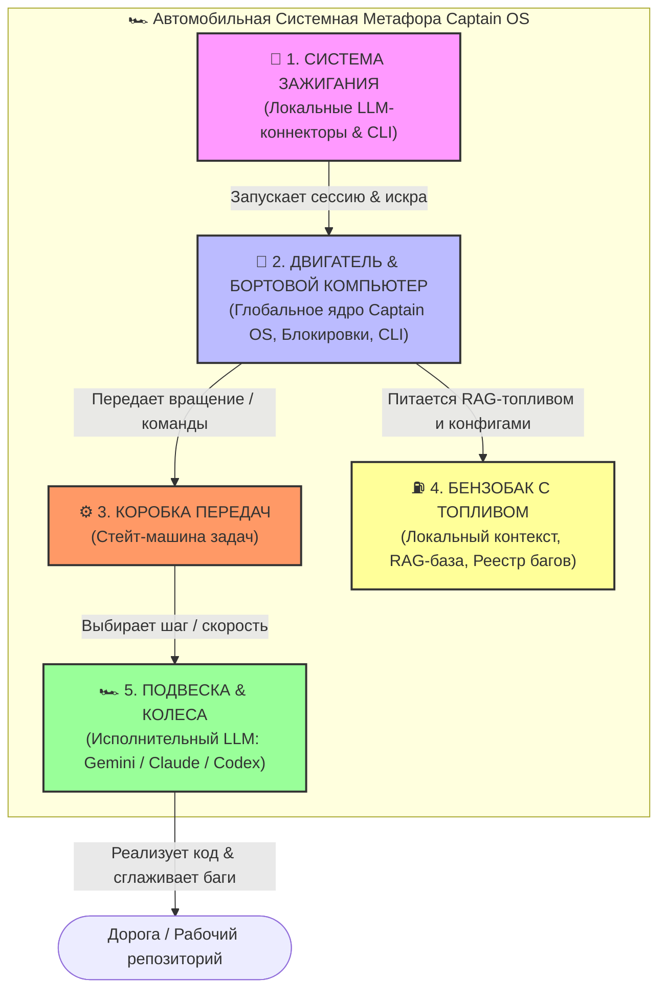

# 📦 🤖 Captain OS: Universal AI Coding Agent Core & Workspace Guard

[](https://opensource.org/licenses/MIT)
[]()
[]()
[]()

> **Captain OS** — это универсальная, переносимая и независимая от моделей (LLM-agnostic) мета-операционная система для автономных ИИ-агентов (Gemini, Claude, OpenAI/Codex). Она превращает обычный репозиторий кода в структурированную, безопасную среду для парного программирования, гарантируя целостность архитектуры, предотвращая регрессии кода и ведя строгий аудит качества.

---

## 🗺️ Общая архитектура & Философия (Автомобильная Системная Аналогия)

Чтобы понять, как устроена и взаимодействует **Captain OS** с вашим проектом, представьте себе гоночный автомобиль, где каждый технический узел отвечает за свою строго определенную задачу:

```text
  ┌──────────────────────────────────────────────────────────────────┐
  │                       1. СИСТЕМА ЗАЖИГАНИЯ                       │
  │        (Локальные LLM-коннекторы, стартер сессии ИИ)             │
  └───────────────────────────────┬──────────────────────────────────┘
                                  │ "Запускает искру"
                                  ▼
  ┌──────────────────────────────────────────────────────────────────┐
  │            2. ДВИГАТЕЛЬ & ЦЕНТРАЛЬНЫЙ КОМПЬЮТЕР                  │
  │     (Ядро Captain OS, Менеджер блокировок, CLI-управление)       │
  └───────────────┬────────────────────────────────┬─────────────────┘
                  │ "Передает крутящий момент"     │ "Питается ресурсами"
                  ▼                                ▼
  ┌──────────────────────────────┐  ┌────────────────────────────────┐
  │     3. КОРОБКА ПЕРЕДАЧ       │  │          4. БЕНЗОБАК           │
  │ (Стейт-машина, spine-снимки) │  │(RAG-индекс, конфиги, баги, Git)│
  └───────────────┬──────────────┘  └────────────────────────────────┘
                  │ "Выбирает режим движения"
                  ▼
  ┌──────────────────────────────────────────────────────────────────┐
  │                      5. ПОДВЕСКА & КОЛЕСА                        │
  │    (Исполнительный LLM-движок: Gemini / Claude / Codex)          │
  └──────────────────────────────────────────────────────────────────┘
```



### 1. 🔑 Система зажигания (LLM-коннекторы и CLI-стартер)
Это пусковой механизм. Когда вы открываете терминал или ИИ-ассистент начинает работу, срабатывает стартер:
* Коннекторы локальных LLM считывают окружение и активируют **Dynamic Captain Mode**.
* Зажигание происходит независимо от того, какая модель за рулем — Gemini, Claude или Codex. Система сама определяет активного водителя и заводит двигатель.

### 2. 🧠 Двигатель & Бортовой Компьютер (Ядро Captain OS)
Двигатель — это центральный управляющий блок (глобальный пакет `captain-os`):
* Он считывает показания приборов (проверяет готовность системы через `Readiness Evaluator`).
* Предотвращает аварии и столкновения изменений (управляет блокировками файлов через `Lock Registry`).
* Координирует работу всех датчиков и дает команды другим узлам.

### 3. ⚙️ Коробка передач (Универсальная Стейт-машина)
Коробка передач отвечает за переключение скоростей и режимы движения (процесс выполнения задач):
* Знает универсальные переходы состояний задачи (`not_started -> in_progress -> review -> done -> merged`).
* Считывает текущее положение шестеренок из локального файла `.captain-os/task-spine.yaml` (spine-снимки) и переводит задачу на нужную "передачу" без риска сломать трансмиссию.

### 4. ⛽ Бензобак (Локальный контекст и RAG-база проекта)
Бензобак — это всё, что является локальной памятью, записями и топливом текущего проекта. Двигатель и коробка передач не сдвинутся с места без этого содержимого:
* **Топливо (RAG-база)**: Проиндексированный контекст исходного кода текущего проекта.
* **Чертежи (.captain-os/project.yaml)**: Индивидуальные параметры (имя проекта, владельца, splash-радиус изменений).
* **Журнал поездки (.ship/repair-ledger.json)**: Список зарегистрированных багов для прохождения гейтов качества.

### 5. 🏎️ Подвеска & Колеса (Исполнительный LLM-рантайм)
Колеса и подвеска — это сама большая языковая модель (Gemini, Claude, Codex), которая непосредственно катится по дороге:
* Подвеска отрабатывает неровности дороги (сложные баги, рефакторинг, конфликты в коде).
* Колеса обеспечивают сцепление с дорогой и двигают весь автомобиль вперед, превращая крутящий момент от двигателя в реальный рабочий прогресс и коммиты в Git.

> **Почему это разделение идеально?**
> Если у вас 10 разных проектов, вам не нужно создавать 10 разных стейт-машин или писать 10 разных систем контроля. У вас один универсальный "двигатель" и "коробка передач" (пакет `captain-os`), который заводится любым локальным коннектором ("зажигание"), потребляет уникальный контекст каждого проекта ("бензобак") и катится на колесах любой выбранной вами ЛЛМки ("подвеска").

---

## 🗺️ Схема взаимодействия компонентов

```mermaid
graph TD
    User([👨‍💻 Разработчик]) -->|1. Зажигание| Session[🤖 LLM Runtime]
    Session -->|2. Выбор водителя| Captain{👑 Active Captain}
    
    subgraph Глобальное Ядро Captain OS (Двигатель / Компьютер)
        CLI[⚡ CLI Engine] -->|npx captain-os init| Wizard[🧙 Onboarding Wizard]
        CLI -->|npx captain-os doctor| Evaluator[📊 Readiness Evaluator]
        Locks[🔒 Lock Registry] -->|register / release| ConflictDetector[⚠️ Conflict Detector]
        StateMachine[⚙️ Универсальная Стейт-машина / Коробка передач]
    end

    subgraph Локальный Проект (Бензобак с контекстом)
        Manifest[.captain-os/project.yaml] -->|Загружается Капитаном| CoreRules
        Spine[.captain-os/task-spine.yaml] -->|Состояние / Положение передач| StateMachine
        Ledger[.ship/repair-ledger.json] -->|Реестр дефектов / Топливо качества| Fermat[🛡️ Fermat Quality Gate]
    end

    subgraph Исполнительный LLM-Движок (Подвеска & Колеса)
        Gemini[🟢 Captain Gemini]
        Claude[🟠 Captain Claude]
        Codex[🔵 Captain Codex]
    end

    Captain -->|3. Загружает правила| Manifest
    Captain -->|4. Блокирует файлы| Locks
    Captain -->|5. Переключает передачи| Spine
    Captain -->|6. Проверяет качество кода| Fermat
    
    StateMachine -->|Управляет колесами| Gemini
    StateMachine -->|Управляет колесами| Claude
    StateMachine -->|Управляет колесами| Codex
```

---

## 🧠 Dynamic Captain Mode (Динамический выбор Капитана)

В отличие от традиционных жестко закодированных ИИ-ассистентов, Captain OS поддерживает **Dynamic Captain Mode**:
* Тот рантайм (терминал, сессия или агент), который **первым запускает рабочее окно**, автоматически принимает на себя роль **Активного Капитана** (Captain Gemini, Captain Claude или Captain Codex).
* Другие языковые модели подключаются по ходу выполнения задач в качестве вспомогательных офицеров (crew/officers) или независимых рецензентов.
* Капитаны общаются на русском языке с владельцем, сохраняя максимальную автономию, но не выходя за рамки разрешенного splash-радиуса изменений.

---

## 🧙‍♂️ Быстрый старт & Интерактивный онбординг (`init` / `setup`)

Для быстрого развертывания Captain OS на любом новом проекте предусмотрен интерактивный онбординг-мастер.

### 1. Установка и запуск инициализации

Перейдите в корень вашего проекта и выполните команду:
```bash
npx -y captain-os init
```
Мастер настройки поприветствует вас, автоматически определит используемый пакетный менеджер (`bun`, `npm`, `pnpm`, `yarn`) и задаст несколько ключевых вопросов:
1. **Имя проекта** (по умолчанию берется из папки).
2. **Имя владельца/разработчика** (для персонализации общения).
3. **Доступные LLM рантаймы** (будут сгенерированы соответствующие адаптеры для Gemini, Claude или Codex).
4. **Директории исходников для RAG** (будут добавлены в конфигурацию поиска).
5. **Путь к реестру ремонта** (для контроля качества изменений).

После завершения настройки мастер автоматически сгенерирует файлы конфигурации `.captain-os/project.yaml` и `.captain-os/runtime-adapters.yaml`, а также предложит сразу запустить индексацию базы знаний RAG.

### 2. Проверка статуса готовности (`doctor` / `readiness`)

Вы всегда можете проверить готовность вашей операционной системы к работе с помощью команды:
```bash
npx captain-os doctor
```
Или локального скрипта оценки готовности в репозитории проекта:
```bash
npm run captain:readiness
```

Вы увидите красивый интерактивный прогресс-бар:
```text
======================================================
📊 Статус готовности Captain OS: [████████████████████] 100%
======================================================

🎉 Поздравляем! Ваша Captain OS настроена на 100% мощности и полностью готова к полету.
```

---

## 🛠️ Архитектурные компоненты в репозитории

```text
├── packages/
│   ├── core/         # Универсальные классификаторы, менеджер блокировок ресурсов и гейты
│   ├── cli/          # Командный интерфейс (index.js, snapshot-engine.js)
│   └── adapters/     # Конфигурационные профили (Gemini, Claude, Codex)
├── templates/        # Скелетные заготовки (project.yaml, runtime-adapters.yaml, managed-blocks)
├── schemas/          # Схемы валидации манифестов и локфайлов
├── fixtures/         # Синтетические тесты окружения
└── docs/             # Документация по безопасности и контракты адаптеров
```

---

## 🤖 Ответ на ключевой вопрос: Где живет стейт-машина выполнения задач?

> **Важная архитектурная деталь:**
> Вся динамическая стейт-машина выполнения задач, спиннер выполнения (`task-spine.yaml`), лок-файлы (`captain-os.lock.json` / `active-locks.json`) и реестры качества (`repair-ledger.json`) **живут непосредственно внутри локального репозитория проекта (Host Project)**, а не в глобальном ядре Captain OS.
>
> **Почему это сделано именно так?**
> 1. **Data Integrity (Целостность данных)**: Состояние работы над конкретными задачами, заблокированные файлы и реестр багов — это неотъемлемая часть кодовой базы самого проекта. Они должны находиться в Git, версионироваться вместе с кодом и быть доступными любому другому разработчику при клонировании репозитория.
> 2. **Cross-Session Recovery (Восстановление сессий)**: Если сессия терминала упадет или вы переключитесь с Gemini на Claude, новый агент мгновенно прочитает `.captain-os/task-spine.yaml` и продолжит работу ровно с того места, где остановился предыдущий.
> 3. **Zero Telemetry & Privacy**: Все доказательства работы (evidence) и дампы остаются локальными в папке `.ship/lab/runs/`, исключая утечку коммерческих данных во внешние системы.

---

## 🛡️ Безопасность и Гейты Качества

Captain OS гарантирует высочайший уровень надежности кода через систему гейтов:
* **Fermat Quality Gate (`repair:gate`)**: Не позволяет замержить ветку в `main`, если в реестре `.ship/repair-ledger.json` остаются неисправленные критические ошибки (P0/P1) или если нарушена синтаксическая валидность самого JSON.
* **StarPom Audit (Авто-валидатор процессов)**: Сканирует измененные файлы на соответствие правилам уставных документов (`AGENTS.md`, `GEMINI.md`, `CLAUDE.md`), проверяет импорты и архитектурные инварианты перед созданием PR.
* **Shadow-by-Default**: По умолчанию система блокировок и контроля запускается в фоновом режиме (Advisory/Shadow), гарантируя разработчику полную свободу и мягкие предупреждения, с возможностью включения жесткого блокирования (Blocking Mode) для критически важных продакшн-релизов.

---

## 📄 Лицензия

Проект распространяется под лицензией MIT. Разработано с любовью ИИ-Капитанами и командой Advanced Agentic Coding в Plexo Institute.
