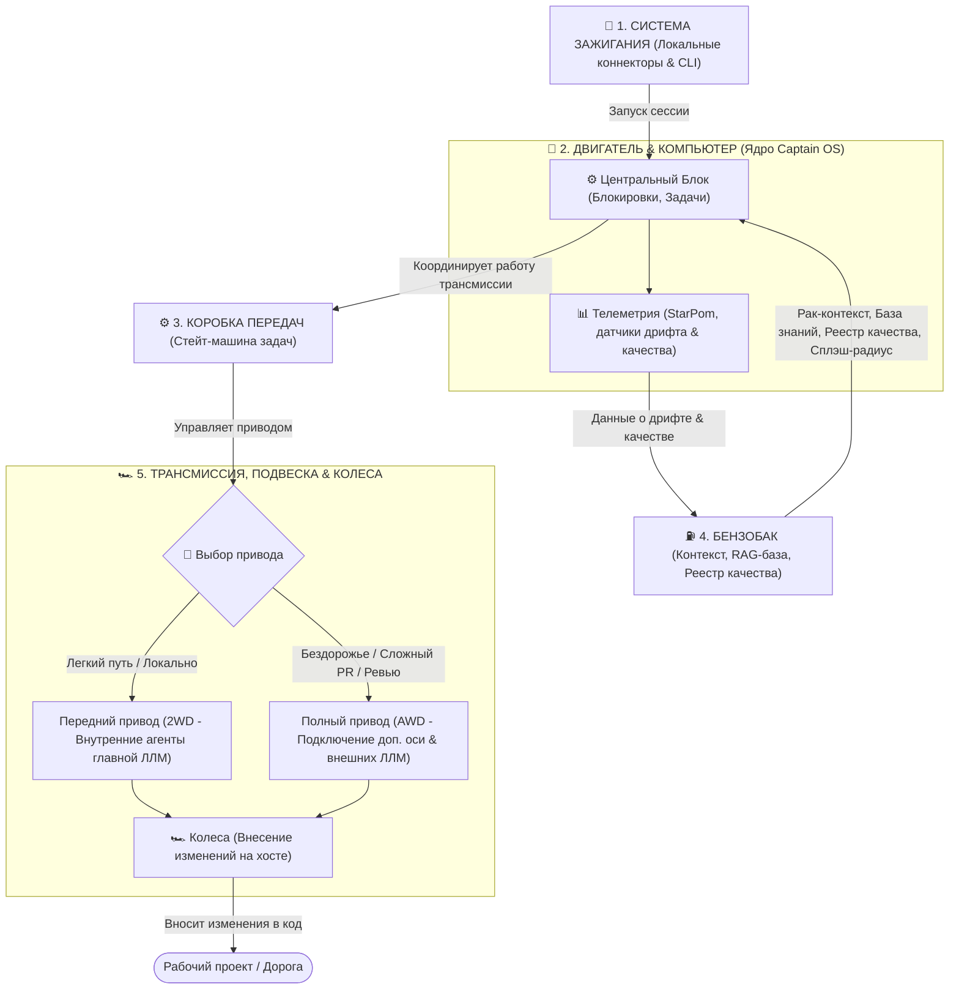
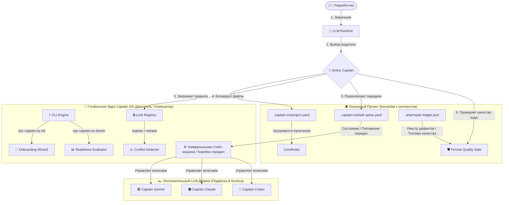
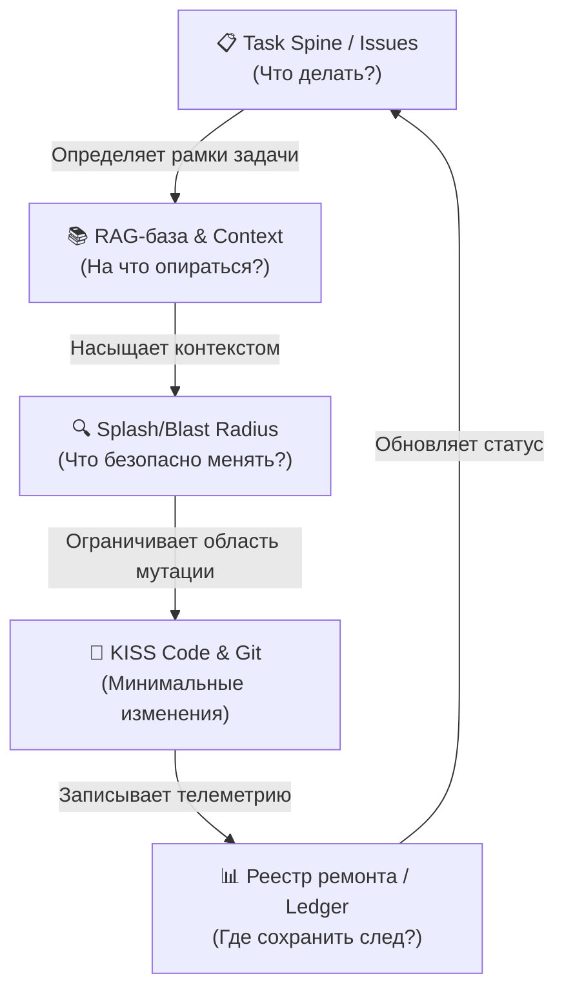

# 📦 🤖 Captain OS: Universal AI Coding Agent Core & Workspace Guard

[](https://opensource.org/licenses/MIT)
[]()
[]()
[]()

> **Captain OS** — это универсальная, переносимая и независимая от моделей (LLM-agnostic) мета-операционная система для автономных ИИ-агентов (Gemini, Claude, OpenAI/Codex). Она превращает обычный репозиторий кода в структурированн�## 🗺️ Общая архитектура & Взаимодействие (Автомобильная аналогия)

Чтобы понять, как устроена и взаимодействует **Captain OS** с вашим проектом, представьте себе автомобиль, где каждый технический узел выполняет свою строго определенную задачу:



### 1. 🔑 Система зажигания (Локальные коннекторы и CLI-стартер)
Это пусковой механизм. Когда вы открываете терминал или ИИ-ассистент начинает работу:
* Коннекторы считывают окружение и активируют **Dynamic Captain Mode**.
* Зажигание происходит независимо от того, какая модель за рулем — Gemini, Claude или Codex. Система сама определяет активного водителя и заводит двигатель.

### 2. 🧠 Двигатель & Бортовой Компьютер (Ядро Captain OS)
Двигатель — это центральный управляющий блок всей системы:
* Он считывает показания приборов (проверяет готовность системы через `Readiness Evaluator`).
* Предотвращает аварии и столкновения изменений (управляет блокировками файлов через `Lock Registry`).
* Координирует работу всех датчиков и дает команды другим узлам.
* **📊 Бортовая Телеметрия**: Отдельные фоновые агенты-наблюдатели (такие как StarPom и локальные сканеры дрифта). Они непрерывно считывают показатели системы, следят за здоровьем кодовой базы, чистотой архитектуры, замеряют уровень готовности системы и сигнализируют о любых отклонениях на приборную панель.

### 3. ⚙️ Коробка передач (Универсальная Стейт-машина)
Коробка передач отвечает за переключение скоростей и режимы движения (процесс выполнения задач):
* Знает универсальные переходы состояний задачи (`not_started -> in_progress -> review -> done -> merged`).
* Считывает текущее положение шестеренок из локального файла `.captain-os/task-spine.yaml` (spine-снимки) и переводит задачу на нужную "передачу" без риска сломать трансмиссию.

### 4. ⛽  Бензобак (Локальный контекст и RAG-база проекта)
Бензобак — это всё, что является локальной памятью, записями и топливом текущего проекта. Двигатель и коробка передач не сдвинутся с места без этого содержимого:
* **Топливо (RAG-база)**: Проиндексированный контекст исходного кода текущего проекта («Рак» / RAG).
* **Чертежи (.captain-os/project.yaml)**: Индивидуальные параметры (имя проекта, владельца, splash-радиус изменений).
* **Журнал поездки (.ship/repair-ledger.json)**: Список зарегистрированных багов для прохождения гейтов качества, куда телеметрия автоматически сбрасывает данные о неисправностях.

### 5. 🏎️ Трансмиссия, Подвеска & Колеса (Исполнительный рантайм изменений)
Этот узел отвечает за то, как крутящий момент от коробки передач переносится на дорожное покрытие (ваш локальный рабочий хост):
* **🏎️ Выбор привода (Распределение усилий ЛЛМ)**:
  * **Передний привод (2WD)**: Работает силами внутренних агентов главной ЛЛМ (активный Капитан, например Gemini). Идеально подходит для быстрой езды по ровной дороге — локальные правки, небольшие изолированные задачи, быстрое прототипирование.
  * **Полный привод (AWD/4WD) с жесткими блокировками**: Подключается автоматически при выезде на бездорожье — сложный междоменный рефакторинг, архитектурные изменения и прохождение гейтов. Включает дополнительные оси в виде внешних ЛЛМ (Claude-Code, Codex) для совместного планирования, перекрестного код-ревью и жесткого контроля качества изменений, исключая конфликты в кодовой базе.
* **Подвеска**: Отрабатывает неровности и выбоины на дороге (сложные баги, конфликты слияния веток, неожиданный дрифт структуры файлов).
* **Колеса**: Обеспечивают сцепление с дорогой и двигают весь проект вперед, превращая команды от двигателя в реальный рабочий прогресс и коммиты в Git.

> **Почему это разделение идеально?**
> Если у вас 10 разных проектов, вам не нужно создавать 10 разных стейт-машин или писать 10 разных систем контроля. У вас один универсальный "двигатель" и "коробка передач" (пакет `captain-os`), который заводится любым локальным коннектором ("зажигание"), потребляет уникальный контекст каждого проекта ("бензобак") и катится на колесах любой выбранной вами ЛЛМки ("подвеска").

---

## 🗺️ Схема взаимодействия компонентов


## 🛡️ Сквозной поток данных и Гейты качества (Quality Gates)

В то время как автомобильная аналогия помогает понять общие принципы работы, на практике **Captain OS** функционирует как строгая инженерная система с замкнутым контуром обратной связи и жесткими программными ограничениями.

### 🌊 Как связаны системы между собой (Сквозной поток данных)

Связка компонентов Captain OS работает как единый шестереночный механизм, исключая человеческие ошибки и предотвращая регрессию:



1. **Task Spine (Позвоночник задач)**: Служит единственным источником правды для определения приоритетов. Он не позволяет ИИ-агенту «придумывать» себе работу или сбиваться с курса. Каждая задача имеет свой уникальный `REPAIR-ID`.
2. **RAG-база знаний**: Насыщает Капитана точными знаниями о коде и спецификациях, исключая галлюцинации и избыточное дублирование.
3. **Splash & Blast Radius**: Четко очерчивает границы изменений. Splash Radius — это файлы, которые мы редактируем непосредственно (`[NEW]` / `[MODIFY]`). Blast Radius — файлы, которые могут пострадать косвенно. Это локализует диффы.
4. **Git-Issues**: Убирает необходимость во внешних тяжелых трекерах. Вся история, требования и изменения живут прямо в репозитории, в ветках вида `task/REPAIR-ID`.
5. **Реестр ремонта (`repair-ledger.json`)**: Фиксирует телеметрию изменений (Compression Ratio, спасенные строки, результаты тестов), формируя долгосрочную память системы.

---

### 🚨 Гейты качества (Quality Gates) на каждой фазе разработки

В нашей системе гейты — это не абстрактные советы, а жесткие программные и логические преграды, которые не позволяют коду продвинуться дальше по пайплайну, если нарушены политики качества.

| Фаза разработки | Активные системы | Действующий гейт (Gate) | Что именно он контролирует? |
| :--- | :--- | :--- | :--- |
| **1. Инициация & Старт** | Task Spine, RAG | **Startup Gate (CAPTAIN_STARTUP_BOOTSTRAP)** | Блокирует запуск, если у ассистента не загружены cockpit-файлы или не определен Dynamic Captain Mode. |
| | | **Session Gap Check Gate (`npm run session:gap`)** | Выявляет расхождения между локальными файлами и Git-историей перед началом работы. |
| | | **Repair Spine Logging Gate** | Блокирует любые мутации кода, если в реестре или Git-issues нет активной зарегистрированной задачи с `REPAIR-ID`. |
| **2. Проектирование** | Splash/Blast Radius | **Conscious Agreement Gate** | **Самый критичный гейт!** Если Splash Radius затрагивает *старые (легаси) файлы*, агент физически не имеет права их менять без явного ручного подтверждения `[Y/N]` оператора. |
| | | **Plan Approval Gate** | При Tier 2+ задачах (архитектура, Captain OS, системные сдвиги) агент обязан создать `implementation_plan.md` и получить ручной аппрув перед написанием кода. |
| **3. Разработка & Рефакторинг** | KISS Code, Git | **KISS Code Check** | Обязывает ассистента вносить минимально возможные изменения: меньше строк, плоская логика, максимальный упор на RAG. |
| | | **Mechanical Rollback Gate (Авиационное резервирование)** | Перед авто-упрощением новых файлов создается снапшот. Запускаются тесты. Если они падают — гейт выполняет мгновенный откат к исходному коду, спасая рантайм от поломки. |
| **4. Локальная приемка** | Реестр ремонта, Git | **Fermat Quality Gate (`validate-lock`)** | CLI-команда `npx captain-os validate-lock` блокирует коммит, если в файле `.captain-os.lock.json` случайно остались локальные флаги блокировок. |
| | | **Repair Gate (`npm run repair:gate`)** | Проверяет целостность структуры реестра дефектов перед финальным рапортом о завершении задачи. |
| | | **StarPom / Design System Audit** | Сканирует измененные файлы на соответствие токенам CSS (`content-css-audit`), предотвращая появление дублирующихся UI-компонентов. |
| **5. Слияние и Деплой** | GitHub PR | **PR Size Ceiling Gate** | Ограничивает размер PR до 10-25 файлов. Всё, что больше 50 файлов, блокируется и принудительно делится на изолированные подзадачи (Large-Slice). |
| | | **Studio/Public Boundary Gate** | Жестко контролирует, чтобы роуты CMS, админки и UI Library были отрезаны от публичного бандла `plexo.institute` и жили только на `studio.plexo.institute`. |
| | | **CI/CD Smoke Gate & Branch Closeout** | Автоматически запускает тесты на GitHub Actions и удаляет ветку после успешного слияния, не оставляя мусора в Git. |

---

## 🧠 Dynamic Captain Mode (Динамический выбор Капитана)

В отличие от традиционных жестко закодированных ИИ-ассистентов, Captain OS поддерживает **Dynamic Captain Mode**:
* Тот рантайм (терминал, сессия или агент), который **первым запускает рабочее окно**, автоматически принимает на себя роль **Активного Капитана** (Captain Gemini, Captain Claude или Captain Codex).
* Другие языковые модели подключаются по ходу выполнения задач в качестве вспомогательных офицеров (crew/officers) или независимых рецензентов.
* Капитаны общаются на русском языке с владельцем, сохраняя максимальную автономию, но не выходя за рамки разрешенного splash-радиуса изменений.

---

## 🧙‍♂️ Быстрый старт & Интерактивный онбординг (`init` / `setup`)

Для быстрого развертывания Captain OS на любом новом проекте предусмотрен интерактивный онбординг-мастер.

### 1. Установка и запуск инициализации

Перейдите в корень вашего проекта и выполните команду:
```bash
npx -y captain-os init
```
Мастер настройки поприветствует вас, автоматически определит используемый пакетный менеджер (`bun`, `npm`, `pnpm`, `yarn`) и задаст несколько ключевых вопросов:
1. **Имя проекта** (по умолчанию берется из папки).
2. **Имя владельца/разработчика** (для персонализации общения).
3. **Доступные LLM рантаймы** (будут сгенерированы соответствующие адаптеры для Gemini, Claude или Codex).
4. **Директории исходников для RAG** (будут добавлены в конфигурацию поиска).
5. **Путь к реестру ремонта** (для контроля качества изменений).

После завершения настройки мастер автоматически сгенерирует файлы конфигурации `.captain-os/project.yaml` и `.captain-os/runtime-adapters.yaml`, а также предложит сразу запустить индексацию базы знаний RAG.

### 2. Проверка статуса готовности (`doctor` / `readiness`)

Вы всегда можете проверить готовность вашей операционной системы к работе с помощью команды:
```bash
npx captain-os doctor
```
Или локального скрипта оценки готовности в репозитории проекта:
```bash
npm run captain:readiness
```

Вы увидите красивый интерактивный прогресс-бар:
```text
======================================================
📊 Статус готовности Captain OS: [████████████████████] 100%
======================================================

🎉 Поздравляем! Ваша Captain OS настроена на 100% мощности и полностью готова к полету.
```

---

## 🛠️ Архитектурные компоненты в репозитории

```text
├── packages/
│   ├── core/         # Универсальные классификаторы, менеджер блокировок ресурсов и гейты
│   ├── cli/          # Командный интерфейс (index.js, snapshot-engine.js)
│   └── adapters/     # Конфигурационные профили (Gemini, Claude, Codex)
├── templates/        # Скелетные заготовки (project.yaml, runtime-adapters.yaml, managed-blocks)
├── schemas/          # Схемы валидации манифестов и локфайлов
├── fixtures/         # Синтетические тесты окружения
└── docs/             # Документация по безопасности и контракты адаптеров
```

---

## 🤖 Ответ на ключевой вопрос: Где живет стейт-машина выполнения задач?

> **Важная архитектурная деталь:**
> Вся динамическая стейт-машина выполнения задач, спиннер выполнения (`task-spine.yaml`), лок-файлы (`captain-os.lock.json` / `active-locks.json`) и реестры качества (`repair-ledger.json`) **живут непосредственно внутри локального репозитория проекта (Host Project)**, а не в глобальном ядре Captain OS.
>
> **Почему это сделано именно так?**
> 1. **Data Integrity (Целостность данных)**: Состояние работы над конкретными задачами, заблокированные файлы и реестр багов — это неотъемлемая часть кодовой базы самого проекта. Они должны находиться в Git, версионироваться вместе с кодом и быть доступными любому другому разработчику при клонировании репозитория.
> 2. **Cross-Session Recovery (Восстановление сессий)**: Если сессия терминала упадет или вы переключитесь с Gemini на Claude, новый агент мгновенно прочитает `.captain-os/task-spine.yaml` и продолжит работу ровно с того места, где остановился предыдущий.
> 3. **Zero Telemetry & Privacy**: Все доказательства работы (evidence) и дампы остаются локальными в папке `.ship/lab/runs/`, исключая утечку коммерческих данных во внешние системы.

---

## 🛡️ Безопасность и Гейты Качества

Captain OS гарантирует высочайший уровень надежности кода через систему гейтов:
* **Fermat Quality Gate (`repair:gate`)**: Не позволяет замержить ветку в `main`, если в реестре `.ship/repair-ledger.json` остаются неисправленные критические ошибки (P0/P1) или если нарушена синтаксическая валидность самого JSON.
* **StarPom Audit (Авто-валидатор процессов)**: Сканирует измененные файлы на соответствие правилам уставных документов (`AGENTS.md`, `GEMINI.md`, `CLAUDE.md`), проверяет импорты и архитектурные инварианты перед созданием PR.
* **Shadow-by-Default**: По умолчанию система блокировок и контроля запускается в фоновом режиме (Advisory/Shadow), гарантируя разработчику полную свободу и мягкие предупреждения, с возможностью включения жесткого блокирования (Blocking Mode) для критически важных продакшн-релизов.

---

## 🪚 Aerospace-Grade SimplifyCode Pipeline (Садоводство Кода)

Спецификация **SimplifyCode** встроена во все контуры работы Captain OS и обеспечивает максимальную чистоту кодовой базы («из коробки» без переусложнения) при соблюдении авиационных стандартов безопасности.

### 🌊 Схема жизненного цикла изменений и рефакторинга


### 🎯 Ключевые принципы конвейера SimplifyCode

1. **Изначальная простота (KISS from the Start)**:
   * Агенты обязаны изменять минимум строк, добавлять минимум функций и классов, полностью опираясь на RAG-контекст проекта и узкий splash-радиус.
   * Упрощение — это не лечение сложного кода задним числом, а изначальный фокус на минималистичных диффах.
2. **Строгая защита легаси (Conscious Agreement)**:
   * Сплэш-радиус задачи может затрагивать старые стабильные файлы, но они **никогда не изменяются автоматически**.
   * Любая оптимизация легаси-кода требует ручного `[Y/N]` согласия разработчика в интерактивном режиме консоли.
3. **Беспрепятственная чистка новых файлов**:
   * Все абсолютно новые файлы, написанные в рамках задачи, уплощаются и чистятся автоматически до идеального плоского вида.
4. **Авиационная отказоустойчивость (Mechanical Rollback)**:
   * Перед любым физическим изменением файлов система делает полную резервную копию. Если после рефакторинга падают тесты проекта, происходит моментальный механический откат, гарантирующий 100% стабильность рантайма.

## 📦 GitHub-интеграция из коробки (Git & GitHub Integration)

Captain OS поставляется с готовым набором шаблонов для GitHub, позволяющих мгновенно развернуть полноценный контур автоматического контроля качества на вашем проекте. 

Шаблоны находятся в папке `templates/github/` и включают:
1. **`pull_request_template.md`** — Шаблон Pull Request с контрольным списком гейтов качества (KISS, Conscious Agreement, Mechanical Rollback, `validate-lock` и лимит размера PR).
2. **`ISSUE_TEMPLATE/captain-repair-issue.md`** — Шаблон для создания задач и дефектов с разметкой Splash/Blast Radius и выделением уникального `REPAIR-ID`.
3. **`workflows/captain-ci-gate.yml`** — CI-пайплайн GitHub Actions, автоматически проверяющий целостность локфайла (`validate-lock`), готовность системы (`doctor`) и запускающий тесты проекта при коммитах и пуллах.

### Как применить в своем проекте:
Просто скопируйте содержимое папки `templates/github/` в директорию `.github/` вашего проекта:
```bash
cp -r templates/github/ .github/
```

---

## 📄 Лицензия

Проект распространяется под лицензией MIT. Разработано ИИ-Капитанами и командой Advanced Agentic Coding в Plexo Institute.
